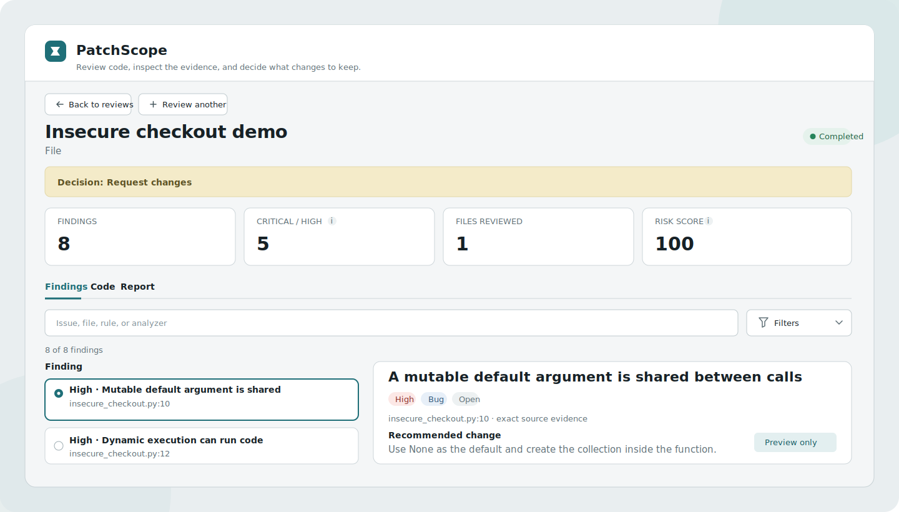

# PatchScope

PatchScope turns source code into an evidence-backed review you can act on. Paste code, upload a
source file or ZIP, or enter a public GitHub pull request; PatchScope finds bugs, security risks,
performance problems, and readability issues, then shows conservative refactor previews.

It runs locally without an API key. Submitted code is analyzed as data, never executed, and never
modified by PatchScope.



## Start in three steps

Requirements: Python 3.12 and [uv](https://docs.astral.sh/uv/). From a cloned checkout:

1. Install the project.

   ```bash
   uv sync
   ```

2. Start the API and workbench together.

   ```bash
   uv run patchscope start
   ```

3. Open `http://127.0.0.1:8501`, choose **Load example review**, then **Run review**.

No `.env` file or provider credential is needed for this flow. The API reference is available at
`http://127.0.0.1:8787/docs` while PatchScope is running.

<details>
<summary>Use a standard Python virtual environment instead of uv</summary>

This installs the current checkout; PatchScope is not being presented here as a PyPI package.

```bash
python3.12 -m venv .venv
source .venv/bin/activate
python -m pip install .
patchscope start
```

On Windows PowerShell, activate the environment with `.venv\Scripts\Activate.ps1`.

</details>

<details>
<summary>Run with Docker</summary>

```bash
docker compose up --build
```

Open `http://127.0.0.1:8501`. The reference stack stores reviews in a named volume and binds both
services to local loopback only.

</details>

## The core workflow

1. **Choose code** — paste one file, upload a source file or bounded ZIP, or enter a canonical
   public pull-request URL.
2. **Run the review** — PatchScope validates the input boundary, then runs the available analysis
   layers without executing submitted code.
3. **Act on evidence** — inspect source-linked findings and preview-only diffs, record triage
   decisions, and export Markdown or SARIF.

Every finding includes severity, category, location, evidence, remediation guidance, and analyzer
provenance. PatchScope never writes a suggested change back to the submitted source.

### Inputs and results

| Input | Best for |
|---|---|
| Pasted code | One focused file or a small reproduction |
| Source file | A single local implementation file |
| ZIP archive | A bounded multi-file change without running repository code |
| Public GitHub PR | Reviewing added lines from a canonical public pull request |

Recognized sources include Python, JavaScript, TypeScript, TSX, Java, Go, Rust, C/C++, C#, Kotlin,
PHP, Ruby, Scala, Swift, shell, and SQL, plus common markup and configuration files. Python receives
additional Ruff and mypy analysis. Other languages use the available Tree-sitter structure,
cross-language rules, and optional Semgrep coverage; analyzer availability is always shown rather
than treated as a pass.

## Use the CLI

Run the credential-free example or review one local file:

```bash
uv run patchscope demo
uv run patchscope review examples/insecure_checkout.py
uv run patchscope analyzers
```

Add `--json` to `demo`, `review`, or `analyzers` when a machine-readable result is useful.

## Optional AI synthesis

PatchScope's deterministic review works without credentials. Copy `.env.example` to `.env` only
when you need to change server-side storage or analysis limits, allow another browser origin, or
opt into provider-backed synthesis. Launcher addresses and ports are explicit command options; run
`uv run patchscope start --help` to see them.

| Mode | Behavior |
|---|---|
| `offline` | Local parsing, deterministic rules, and available static analyzers only |
| `auto` | Uses OpenAI only when a PatchScope server-side key is configured; otherwise remains offline |
| `openai` | Requires a server-side key and fails explicitly when synthesis cannot run |

Provider output cannot erase deterministic findings and must match submitted paths, line ranges,
and exact source evidence. Keys belong only on the API process; the browser client never needs
them.

Semgrep is also optional and isolated from the application environment:

```bash
uv tool install "semgrep>=1.170,<2"
```

Use `patchscope analyzers` to see which analysis layers are available.

## Data, privacy, and deployment boundary

- SQLite review history is stored in `.data/patchscope.db` by default. Treat it as sensitive because
  it contains submitted source snapshots.
- PatchScope performs no telemetry by default.
- Imported source, tests, hooks, plugins, builds, and package managers are never executed.
- Public pull requests work without a token. `PATCHSCOPE_GITHUB_TOKEN` is an optional server-side
  credential for authenticated GitHub reads; private-repository behavior is not part of the
  supported or validated `0.1.x` contract.
- The included server and Compose stack are local, single-user references. They are not hardened
  public multi-user hosting configurations.

Read [the security design](docs/security.md) before processing sensitive code or adapting
PatchScope for shared infrastructure.

## Extend or integrate

PatchScope has explicit contracts for analyzers, findings, parsing, refactor previews, API schemas,
and persistence. It deliberately does not load third-party or repository-owned plugins at runtime;
extensions are reviewed source changes.

- [Extension guide](docs/extending.md) — add an analyzer, rule, language, refactor, or API field
- [API guide](docs/api.md) — request examples, routes, limits, and exports
- [Architecture](docs/architecture.md) — component and trust boundaries
- [Contributing](CONTRIBUTING.md) — setup, tests, and pull-request expectations

## Help and project policies

- [Support](SUPPORT.md) explains where to ask questions and what diagnostics to include.
- [Security policy](SECURITY.md) explains private vulnerability reporting.
- [Code of Conduct](CODE_OF_CONDUCT.md) sets community expectations.

PatchScope is available under the [MIT License](LICENSE).
